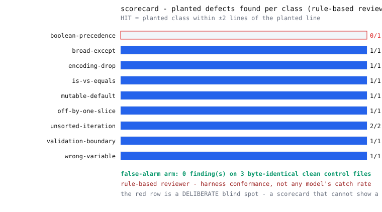
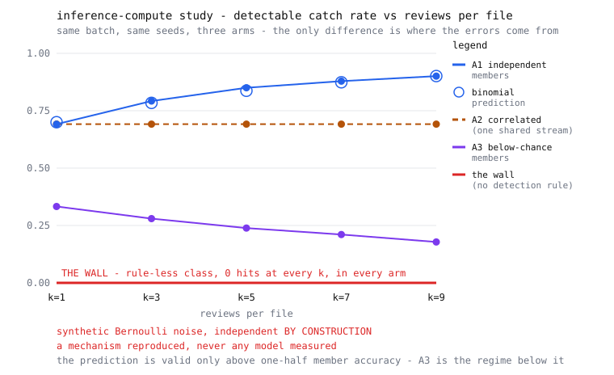

# agent-mutation-lab



**Mutation testing where the subject under test is an AI code reviewer.**
Plant exactly one known defect from a documented incident class into clean
source, mix the mutants with byte-identical clean control files, and score the
reviewer on finding *that* defect at *that* line — where crying wolf scores
zero.

> **Every number below regenerates in CI with zero API keys — if a claim
> drifts, the build fails.** (`pytest` → hygiene gate → full run → `git diff
> --exit-code`, on Windows and Linux.) The bundled reviewer is deterministic
> rules: its numbers are harness conformance, never any model's catch rate —
> see *What this does NOT show*.

**🎛 Interactive walkthrough:** [lzbiala.github.io/agent-mutation-lab/docs](https://lzbiala.github.io/agent-mutation-lab/docs/) —
click through the pipeline, the defect gallery, and the verdict replay in your browser.

## The idea in 30 seconds

You don't find out whether your smoke alarm works by waiting for a fire. You
light a **controlled puff of smoke** and check the alarm rings — and, just as
important, you check it stays *quiet* on a normal day, because an alarm that
screams at everything is as useless as one that never goes off. This lab does
that for AI code reviewers: plant one known bug, check it's found at the right
line, and mix in clean files so that flagging everything scores zero.

Mutation testing is a classical software technique — decades old, normally
aimed at test suites. The only new move here is the subject: the thing being
tested is the reviewer.

**What this is NOT:** not a benchmark of any AI model, not a bug-finding tool
for your codebase, and not a claim that rule-based review works. It is an
**evaluation harness**: the injection engine, the sealed answer key, the
false-alarm arm, and a scoring pipeline you can point at any reviewer you
bring.

## Quickstart (no keys)

```
git clone https://github.com/LZBiala/agent-mutation-lab
cd agent-mutation-lab
pip install -e .          # installs nothing but this package — runtime is stdlib-only
python -m mutationlab demo
```

Seconds later: a reviewable corpus in `batches/`, a verdict log in `runs/`,
and a freshly computed scorecard.

## Anatomy of one mutation

The defect pack holds **9 classes**, each a documented real-world incident
pattern (the stories live in `defects.py`). One example — `mutable-default`,
planted into the catalog fixture:

```diff
-    tags: list[str] | None = None,
+    tags: list[str] = [],
```

One line. The function signature still type-checks, tests that construct one
record still pass — and every call now shares one list, so records accumulate
each other's tags under load. The engine records the struck line in a sealed
answer key; the reviewer must name this class within ±2 lines to score a HIT.

The engine's contract (enforced by tests): **mutate or refuse, never no-op** —
if the target pattern is absent the mutator returns `None` rather than guess,
because a silently unchanged "mutant" would score the reviewer a MISS on a
file that contains no defect.

## The scoring rules

- **HIT** — a finding with the planted class within ±2 lines of the planted line.
- **MISS** — a mutant with no matching finding.
- **FALSE ALARM** — *any* finding on a byte-identical clean control file.
- **SPURIOUS** — a finding on a mutant that does not match the planted defect;
  counted and published, so noise on mutants pays a visible price too.

Flag everything → the false-alarm and spurious counts destroy you. Flag
nothing → misses do. The measurement lives between.

## Why this matters — the mechanism, labeled

AI reviewers are being wired into pipelines as **gates**: they approve merges,
triage findings, and block releases. A gate you have never tested with known-bad
input is an unmeasured gate — you know neither what it catches nor what it
waves through, and its failure mode is silent. Planting documented defects is
the cheapest way to buy that measurement: the ground truth is exact (you put
the bug there), the false-alarm cost is visible (clean controls), and the
whole thing replays deterministically in CI. This repo measures the harness
side; pointing it at your live reviewer is the measurement that matters — and
it belongs to you.

## Claims, treated like SLOs

Rendered from `metrics.jsonl` by `report.py` — no measured number below is
typed by hand, and CI fails if regeneration disagrees.

<!-- AUTOGEN:BEGIN — rendered by report.py from metrics.jsonl; do not edit by hand -->

| claim | number (regenerated by CI) | how measured | honest caveat |
|---|---|---|---|
| The harness plants real defects and scores them at the right line | **9/10 planted defects flagged at the planted line (±2), across 9 classes** | every applicable (defect, file) pair injected once; the sealed answer key is generated with the batch; the bundled rule-based reviewer replays in CI | HARNESS CONFORMANCE, not a catch rate — the bundled reviewer is deterministic rules, and its blind spot is deliberate (see next row) |
| A miss looks like a miss | **missed class(es): boolean-precedence** | the bundled reviewer ships with NO rule for that class, so the scorecard contains a real MISS row | a harness whose demo scores 100% teaches nothing about what failure output looks like; the blind spot is documented in reviewer.py |
| Crying wolf scores zero | **0 finding(s) on 3 byte-identical clean control files; 0 spurious finding(s) on mutants** | every fixture is included unmodified in the batch; any finding on it counts against the reviewer, and findings on mutants that do not match the planted defect are counted as spurious | with a rule-based reviewer both are 0 by construction — the arms exist so that a LIVE reviewer cannot score by flagging everything |
| The planted defects are behavioral, not cosmetic | **4 classes proven by executable probes** (mutable-default, off-by-one-slice, wrong-variable, validation-boundary) | tests exec the mutated module and drive the bug: pass on clean, misbehave on mutant | the other classes are structural patterns whose harm is documented per class in defects.py rather than executed |

<!-- AUTOGEN:END -->

Regenerate everything yourself: `python -m mutationlab demo --quiet && git diff`.

## Experiment: test-time compute (self-consistency)

### The pillar in 30 seconds

Two familiar levers on model capability are pretraining scale and
post-training. A third is how much compute you spend *at inference* — asking k
times and keeping the consensus instead of asking once. That three-way framing
is taxonomy, borrowed from a recent industry talk; taxonomy is not evidence,
and nothing here measures any product. What this section publishes is the
third pillar's **mechanism, reproduced in a synthetic harness with zero API
keys**: exactly what majority voting can and cannot do to a reviewer's errors,
under conditions we set ourselves.

The smoke-alarm picture again. Nine alarms in nine rooms catch more fires than
one alarm in one room. Nine alarms wired to the *same* sensor catch exactly
what one catches — you bought nine alarms and one opinion. And no number of
alarms, however wired, detects a gas the sensors were never built to smell.
All three of those are measured below.

### The apparatus

- **`NoisyReviewer`** wraps the bundled rule reviewer and makes it fallible:
  each real finding survives with probability 0.70, and with probability 0.10
  the member invents one finding that was never there. False alarms fire on
  **clean and mutant files alike** — noise that knows which files are clean is
  answer-key leakage, and a curve built on it would be fiction. The invented
  class is drawn only from classes the reviewer carries a rule for: it can
  mistake something for a defect it knows, never for one it cannot see.
- **`PanelReviewer`** runs k members over the same file and keeps the
  `(line, class)` cells a majority names. The note is excluded from the vote
  key — otherwise the panel would be scoring prose similarity, not agreement.
  k is odd, always: an even panel can tie, and a tie has no majority.
- **Determinism.** Every random stream is derived from
  `(run seed, trial, member index, sha256 of the file)`, so a verdict is a
  pure function of the file. Order-independent, platform-independent, and
  drift-gated in CI like everything else here.
- **Scoring.** Panels are scored by the same `match_findings` the v1.0
  pipeline uses — one definition of HIT, or the two studies would not be
  comparable while both looked right.

### The curve



<!-- AUTOGEN:TTC:BEGIN — rendered by report.py from metrics-ttc.jsonl; do not edit by hand -->

**Apparatus.** 200 pre-registered trials over the same batch: 10 mutants (9 of them detectable, spread across 8 classes — one class plants twice) and 3 byte-identical clean controls. Members miss a real finding at rate 0.3000 (arm A3: 0.6500) and invent a bogus one at rate 0.1000 per file, clean or mutant alike. Every point below is 200 x 9 = 1800 detectable mutant reviews and 200 x 3 = 600 clean reviews. Vote key: (line, class), majority of k, k odd.

**The curve — detectable catch rate.** The prediction column is the exact binomial tail for this vote rule, valid only where member accuracy exceeds one half.

| reviews per file (k) | A1 independent | A2 correlated (shared stream) | A3 below-chance | binomial prediction (A1) |
|---|---|---|---|---|
| **1** | 0.7039 | 0.7039 | 0.3444 | 0.7000 |
| **3** | 0.7867 | 0.7039 | 0.2678 | 0.7840 |
| **5** | 0.8317 | 0.7039 | 0.2311 | 0.8369 |
| **7** | 0.8678 | 0.7039 | 0.1906 | 0.8740 |
| **9** | 0.9028 | 0.7039 | 0.1628 | 0.9012 |

**Diminishing returns.** The first two extra reviews (k=1 to k=3) buy **+0.0828** detectable catch. The last two (k=7 to k=9) buy **+0.0350** — **0.42x** the gain, at exactly the same marginal cost of two more reviews.

**The cost — noise the panel pays for.** A false alarm is any finding on a clean control; a spurious finding is one on a mutant that does not match the planted defect.

| reviews per file (k) | A1 false alarms per clean review | A1 spurious per mutant review | A2 false alarms per clean review |
|---|---|---|---|
| **1** | 0.0900 | 0.1005 | 0.0900 |
| **3** | 0.0000 | 0.0000 | 0.0900 |
| **5** | 0.0000 | 0.0000 | 0.0900 |
| **7** | 0.0000 | 0.0000 | 0.0900 |
| **9** | 0.0000 | 0.0000 | 0.0900 |

**The wall — class(es) with no detection rule: boolean-precedence.** No member can find them, so no majority can either. Zero by construction, published at every k in every arm.

| rule-less class | arm | k=1 | k=3 | k=5 | k=7 | k=9 | reviews per point |
|---|---|---|---|---|---|---|---|
| boolean-precedence | A1 independent | 0 | 0 | 0 | 0 | 0 | 200 |
| boolean-precedence | A2 correlated (shared stream) | 0 | 0 | 0 | 0 | 0 | 200 |
| boolean-precedence | A3 below-chance | 0 | 0 | 0 | 0 | 0 | 200 |

<!-- AUTOGEN:TTC:END -->

### Where it wins

Independent members, majority vote: detectable catch climbs from k=1 to k=9 by
roughly twenty points (the pre-registered gate demanded at least +0.15; the
measured figure is in the table, regenerated by CI). False alarms do better
than climb — they **collapse**, from the configured 0.10 per clean review at
k=1 to effectively zero by k=3, because idiosyncratic invented findings almost
never agree on an identical `(line, class)` cell. That asymmetry is the real
prize: voting keeps the signal members share and discards the noise they do
not.

### Where it loses — same billing, same gates

**THE WALL.** The one defect class the reviewer has no rule for scores **zero
at every k, in every arm** — and zero *by construction*, since a member cannot
invent a class it has no detector for. Voting cannot manufacture capability
that no member has. Inference compute is a multiplier on existing competence,
and a multiplier applied to zero is zero. If your reviewer is blind to a
failure mode, sampling it nine times buys nine confident silences.

**THE PLACEBO.** Arm A2 gives the panel nine seats sharing one error stream —
the correlation dial turned all the way to one, the direction samples from a
single model at a single temperature tend to lean. It burns 9x the reviews for
a hit count that is *integer-identical* to k=1 at every k. Not "a small gain";
the same number, gate-checked at zero tolerance. **Independence is the active
ingredient, not the count** — and independence is exactly what k samples from
one model cannot be *assumed* to have. A2 is the endpoint, not the forecast:
real panels land somewhere on the span between this flat line and A1's curve,
and where they land is an empirical question this harness does not answer.

**THE BELOW-CHANCE ARM.** Arm A3 runs members whose accuracy is 0.35, under
one half. The curve does not flatten — it **descends**: voting amplifies error
just as reliably as it amplifies signal, and the same binomial arithmetic
drives both directions. Above one-half accuracy more seats help; below it,
more seats hurt. Spending compute on a panel that is wrong more often than
right makes it more confidently wrong.

**DIMINISHING RETURNS.** The step from k=7 to k=9 buys well under half of what
the step from k=1 to k=3 bought, at exactly the same marginal cost of two more
reviews — the exact ratio is in the table above, derived from the metrics file
rather than typed here, so it cannot drift away from the numbers it describes.
The curve is a tail probability; tails flatten. Any budget argument that treats
k as linear in value is wrong on the harness's own numbers.

### Reproduce it

```
python -m mutationlab demo --quiet && git diff    # expect: no output
```

The study runs inside the same demo as everything else: no keys, no network,
no clock. `metrics-ttc.jsonl` and `report/ttc-curve.svg` are committed, and CI
regenerates and diffs them on Windows and Linux — so every number in the table
above is a claim the build defends.

## What this does NOT show

The bundled `MockReviewer` is deterministic pattern rules. Rules that detect
defects the same author planted prove exactly one thing: **the harness works**
— defects are real, the key is correct, hits score at the right lines, and
clean files stay clean. They prove nothing about any AI. That is why one
class has *no detection rule on purpose*: a demo that scores 100% can't even
show you what a miss looks like.

What would be a real measurement: a live model reviewing the same batches.
Those numbers need run-to-run variance, pinned model versions, and their own
error bars — they belong to whoever runs them, and **they will never appear
in this README**.

### And specifically, about the test-time-compute section

- **The noise is synthetic, and its independence is BY CONSTRUCTION.** Arm A1
  draws each member's errors from its own seeded stream, which is the friendly
  extreme, not the normal case. Real samples from one model share a prior and
  therefore share errors. So real gains sit **at or below** the independent
  curve depending on how correlated the errors are — and where per-item
  accuracy falls under one half, voting **hurts**, which is the regime arm A3
  measures directly. The flat correlated line is not a floor; A3 is what lies
  under it.
- **The vote is exact-key, not semantic.** Members agree only when they name
  the same line and the same class id. Real reviewers phrase one finding five
  ways and point at neighbouring lines; clustering those into a single vote is
  a hard, generally unsolved problem this harness does not attempt. Exact-key
  voting is the *optimistic* simplification here.
- **The Condorcet match validates arithmetic, not intelligence.** That the
  empirical points land on the binomial tail says this harness's vote counting
  and its noise model agree with the mathematics they were built from. It says
  nothing about any model's accuracy — and the prediction itself is valid only
  above one-half per-member accuracy.
- **No number here supports any vendor's product claim.** Nothing in this
  section was measured on a commercial system, and none of it should be quoted
  as evidence about one. A recent industry talk supplied the framing that
  inference compute is a third lever worth studying; it supplied no data, and
  every figure above came out of this repo.

## Bring your own reviewer (v1.1 seam)

`reviewer.Reviewer` is the interface: implement `review(source_name, text) ->
list[Finding]` with a live model, run the same pipeline, and read your own
scorecard. Watch for: the false-alarm arm (models love to find *something*),
line accuracy (±2 is generous), and class confusion (calling a boundary bug a
style issue is a miss). Feed your reviewer from `batches/` — the filenames
are opaque on purpose — and keep `runs/answer-key.json` out of its context:
it is answer-side material, which is why it does not live in the corpus
directory.

## Design notes for engineers

- **Why regex-narrow mutators:** a half-applied clever transform produces a
  file with no clean answer key. Brittleness admitted and fenced (the
  refuse-contract is tested against every non-target fixture) beats
  robustness claimed and unverified.
- **Why the fixture app is boring:** a tiny town-library catalog, logical day
  numbers instead of dates, stdlib only, self-contained modules — so mutants
  can be executed in isolation, which is how the behavioral probes prove the
  planted bugs actually bite (shared-state leak, broken limit, wrong amount,
  admitted zero).
- **Why the deliberate blind spot:** `boolean-precedence` has no detection
  rule, so the shipped scorecard contains a real red row. An evaluation
  harness should demonstrate its failure rendering, not just its success
  rendering.
- **What I'd build next:** a second fixture domain to test rule
  generalization; multi-defect batches (compound incidents); a
  wrong-class-but-right-line partial-credit study.

## Repo map, tests, CI

```
src/mutationlab/    defects (the pack + engine), batch, reviewer, runner, report
                    noise, panel, experiment — the inference-compute study
fixtures/           catalog_app — the clean, self-contained mutation targets
batches/ runs/ report/ metrics.jsonl metrics-ttc.jsonl — generated artifacts, committed on purpose
tests/              engine contract, behavioral probes, batch/reviewer/pipeline suites,
                    noise/panel contracts, the ten pre-registered study gates
tools/              blocklist_check.py — repo hygiene gate (the repo's first commit)
docs/               the interactive walkthrough page
```

CI (Windows + Linux, pinned Python, zero secrets): pytest → hygiene gate →
full regeneration → `git diff --exit-code`. **The committed artifacts ARE the
claims; CI proves they regenerate.**

## Field notes (2026)

Evaluation practice in 2026 moved toward stress-testing the evaluators
themselves — judge/reviewer meta-evaluation. This harness does that with
planted defects and byte-identical clean controls: ground-truth controls that
score false alarms as failures, which perturbation-only protocols cannot. In
current vocabulary: a behavioral defect-detection eval with known-ground-truth
controls. Further reading on failure attribution: ["Model or
Harness?"](https://arxiv.org/abs/2607.28802).

## Roadmap

Both items are future work — neither has been run.

- **Harness-vs-model ablation:** rerun the suite across 2 models x 2 harness
  configurations and attribute failures using the model-or-harness taxonomy —
  tests whether findings generalize or are harness-specific.
- **k-run live-model variance study:** to be published as a separate, clearly
  labeled study — never inside the CI-gated claims above, per the standing
  rule that live-model results stay out of drift-gated sections.

## License

MIT.
